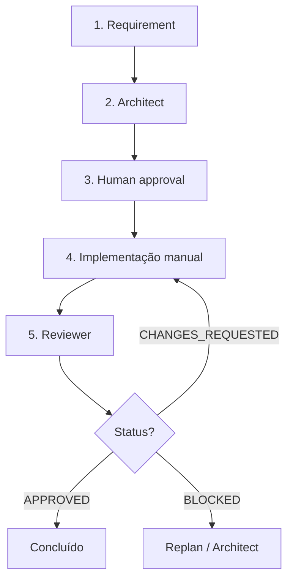

# Workflow: Feature (Phase 0)

```yaml
id: feature
version: 0.1.0
phase: 0
mode: manual  # Cursor | Claude Code | … + Markdown; sem CLI ainda
```

Orquestração **manual** para validar o processo antes do runtime Python. Cada passo indica agente, entradas e artefato.

## Escopo Phase 0

Incluído nesta versão:

- Captura de requisito
- Architect → `architecture.md`
- Aprovação humana
- Implementação **fora** deste workflow (você ou o agente genérico do IDE)
- Reviewer → `code-review.md`

Fora do escopo (fases posteriores): Challenger, Coder, Tester, Security como agentes dedicados; loops automáticos.



## Pré-requisitos

- Repositório aberto no **Cursor** ou **Claude Code** (ou host genérico com acesso aos arquivos)
- Host configurado: [`.cursor/rules/eas.mdc`](../../.cursor/rules/eas.mdc) (Cursor) e/ou [`CLAUDE.md`](../../CLAUDE.md) (Claude Code)
- Opcional: `.ai/project.yaml` e `.ai/rules/*.md` (Phase 1)
- Pasta `.ai/workspace/` existe

Guia de hosts: [.ai/hosts/README.md](../hosts/README.md)

## Passo 1 — Requirement

**Responsável:** humano

Criar ou editar `.ai/workspace/requirement.md`:

```markdown
# Requirement

## Title
<nome curto>

## Problem
<por que fazer>

## User story
Como <persona>, quero <ação> para <benefício>.

## Acceptance criteria
- [ ] ...
- [ ] ...

## Constraints
- ...

## Out of scope
- ...
```

## Passo 2 — Architect

**Agente:** [.ai/agents/architect.md](../agents/architect.md)

**Contexto** (Cursor: `@` nos paths; Claude Code: `Read` nos paths):

- `.ai/agents/architect.md`
- `.ai/workspace/requirement.md`
- `.ai/project.yaml`, `.ai/rules/` (se existirem)
- Prompt: [.ai/hosts/prompts.md#architect](../hosts/prompts.md#architect)

**Saída:** `.ai/workspace/architecture.md`

**Checklist antes de seguir:**

- [ ] Open questions críticas respondidas ou aceitas como risco
- [ ] Escopo MVP explícito
- [ ] `status` no YAML do artefato = `ready_for_review` (após sua revisão)

## Passo 3 — Human approval

**Responsável:** humano

Revisar `architecture.md`. Registrar decisão em `.ai/workspace/approval.md` (opcional mas recomendado):

```yaml
# eas-approval v0.1
workflow: feature
step: architecture
decision: approved  # approved | rejected | approved_with_notes
approved_at: "<ISO-8601>"
notes: ""
```

Se `rejected`, volte ao passo 2 com feedback no requirement ou no chat.

## Passo 4 — Implementação

**Responsável:** desenvolvedor / agente do IDE (não há `.ai/agents/coder.md` na Phase 0)

Implementar conforme `architecture.md`. Commits no branch de feature.

Boas práticas:

- Não desviar do design sem atualizar `architecture.md` ou registrar nota em `approval.md`
- Rodar testes/lint do projeto antes do review

## Passo 5 — Reviewer

**Agente:** [.ai/agents/reviewer.md](../agents/reviewer.md)

**Contexto:**

- `.ai/agents/reviewer.md`
- `.ai/workspace/architecture.md`
- Diff (`git diff main...HEAD` ou equivalente)
- Prompt: [.ai/hosts/prompts.md#reviewer](../hosts/prompts.md#reviewer)

**Saída:** `.ai/workspace/code-review.md`

## Passo 6 — Encerramento

| `status` no review | Ação |
|--------------------|------|
| `APPROVED` | Merge / deploy conforme processo do time |
| `CHANGES_REQUESTED` | Corrigir → repetir passo 5 |
| `BLOCKED` | Parar; revisar arquitetura (passo 2) ou escopo (passo 1) |

## Artefatos esperados ao final

```text
.ai/workspace/
├── requirement.md
├── architecture.md
├── approval.md          # recomendado
├── code-review.md
└── runs/                # opcional: snapshots por data-id
```

## Prompt único (feature de ponta a ponta)

Copie de [.ai/hosts/prompts.md#feature](../hosts/prompts.md#feature) — mesmo texto no Cursor e no Claude Code.

## Evolução (Phase 4+)

Este arquivo permanece a **especificação** do workflow; a CLI (`engineering-agent feature`) deverá:

1. Carregar este manifest
2. Resolver agentes por `id`
3. Validar schemas `eas-artifact` nos outputs
4. Aplicar `approval` e `limits` de `.ai/project.yaml`
