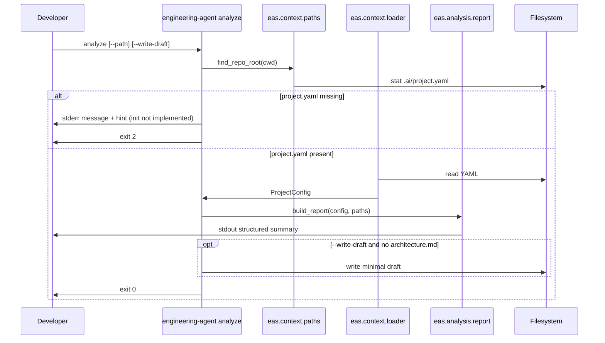

# Architecture — CLI `engineering-agent analyze` (Phase 0 stub)

## Summary

Este requisito introduz o **primeiro executável** do Engineering Agent System (EAS): um pacote Python com o subcomando `analyze`, que carrega contexto mínimo do projeto (via `.ai/project.yaml` quando existir) e emite um **relatório estruturado** na stdout, orientando o desenvolvedor a invocar o agente Architect manualmente (Phase 0). **Dentro do escopo:** layout `src/eas/`, `pyproject.toml`, entrypoint documentado, módulo de contexto com teste unitário, stub de `analyze` sem LLM. **Fora do escopo:** `init` com auto-detection, invocação de APIs de modelo, PyPI e substituição dos agentes Markdown.

## Requirements

### Funcionais

| ID | Descrição | Prioridade |
|----|-----------|------------|
| F1 | Pacote instalável com console script `engineering-agent` | [MVP] |
| F2 | Subcomando `analyze` executável na raiz (ou diretório informado) de um repo | [MVP] |
| F3 | Se `.ai/project.yaml` existir, carregar e refletir campos relevantes na saída | [MVP] |
| F4 | Se `.ai/project.yaml` ausente, mensagem clara de erro/aviso (init ainda não existe) | [MVP] |
| F5 | Saída menciona `.ai/workspace/architecture.md`; opcionalmente cria rascunho mínimo se arquivo não existir | [MVP] |
| F6 | Placeholder explícito: invocar Architect via `.ai/hosts/prompts.md` (sem LLM no CLI) | [MVP] |
| F7 | README na raiz com instalação e exemplo de uso do `analyze` | [MVP] |
| F8 | Comando `init` gerando `project.yaml` por auto-detection | [later] |
| F9 | `analyze` dispara agente Architect automaticamente | [later] |

### Não funcionais

| ID | Descrição | Prioridade |
|----|-----------|------------|
| NF1 | Python ≥ 3.11 | [MVP] |
| NF2 | Dependências de runtime mínimas (CLI framework + PyYAML se necessário; stdlib preferida onde couber) | [MVP] |
| NF3 | Exit code não-zero quando contexto obrigatório para análise estiver ausente (falha previsível para CI futuro) | [MVP] |
| NF4 | Código alinhado à estrutura futura em `docs/estrutura-repositorio.md` (pastas `context/`, `adapters/`, etc.) sem implementar tudo | [MVP] |
| NF5 | Saída legível em terminal (texto estruturado; sem TUI pesada) | [MVP] |
| NF6 | Observabilidade estruturada (logs JSON, métricas) | [later] |

## Current state

O repositório está em **Phase 0 orientada a Markdown**:

- **Agentes e workflows:** `.ai/agents/architect.md`, `.ai/agents/reviewer.md`, `.ai/workflows/feature.md`, hosts em `.ai/hosts/`.
- **Workspace:** `.ai/workspace/requirement.md` e este `architecture.md` — **este documento é o artefato da execução architect (smoke Phase 0 / requirement CLI `analyze`).**
- **Contexto de projeto:** `.ai/project.yaml` **não existe** no repo; `.ai/rules/` também **não existe** (previsto para Phase 1).
- **Código Python:** ausente — sem `src/`, `tests/`, `pyproject.toml` ou `README.md` na raiz.
- **Documentação de produto:** `docs/primeiro-mvp.md` descreve o fluxo alvo `init → analyze → review`; `docs/cli.md` lista comandos futuros; `docs/contexto-do-projeto.md` exemplifica schema informal de `project.yaml`.

Integrações externas tocadas nesta entrega: **nenhuma** (filesystem local apenas).

## Proposed design

### Componentes e responsabilidades

```text
engineering-agent (console script)
└── eas.cli                    # Typer app raiz; registra subcomandos
    ├── eas.commands.analyze   # Orquestra analyze: contexto → relatório → artefato
    ├── eas.context.loader     # Leitura/validação leve de .ai/project.yaml
    ├── eas.context.paths      # Resolução de repo root e paths .ai/*
    ├── eas.analysis.report    # Montagem do texto estruturado (stack, gaps, next steps)
    └── eas.analysis.draft     # Template mínimo de architecture.md (opcional, idempotente)
```

| Componente | Responsabilidade |
|------------|------------------|
| `eas.cli` | Entrypoint único; `--version`; delega a `analyze` |
| `eas.context.loader` | `load_project_config(root: Path) -> ProjectConfig \| LoadError`; parse YAML; campos opcionais com defaults |
| `eas.context.paths` | `find_repo_root(cwd) -> Path` (heurística: presença de `.ai/` ou `.git`); paths canônicos para `project.yaml`, `requirement.md`, `architecture.md` |
| `eas.commands.analyze` | Fluxo do comando; define exit codes; flags `--path`, `--write-draft` (recomendado) |
| `eas.analysis.report` | Serializa resumo humano (seções fixas) a partir de `ProjectConfig` + leitura opcional de título em `requirement.md` |
| `eas.analysis.draft` | Gera markdown mínimo com cabeçalho, link para prompts e checklist “invoke architect”; **não** preenche as 11 seções do agente |

Pastas reservadas (vazias ou `__init__.py` apenas) para evitar refactor prematuro: `eas/agents/`, `eas/workflows/`, `eas/tools/`, `eas/adapters/` — espelham `docs/estrutura-repositorio.md`.

### APIs / contratos

**CLI (interface pública desta entrega):**

| Comando | Args / flags | Comportamento | Exit code |
|---------|--------------|---------------|-----------|
| `engineering-agent` | — | Mostra help Typer | 0 |
| `engineering-agent analyze` | `[--path DIR]` default `.` | Tenta carregar contexto; imprime relatório | 0 se OK; 2 se `project.yaml` ausente; 1 erro inesperado |
| `engineering-agent analyze` | `--write-draft` | Se `.ai/workspace/architecture.md` não existir, cria rascunho mínimo; se existir, não sobrescreve (unless `--force` [later]) | idem |

**Contrato interno — `ProjectConfig` (dataclass ou TypedDict):**

Campos espelhando o exemplo em `docs/contexto-do-projeto.md` (todos opcionais após parse):

- `project.name: str | None`
- `language.name`, `language.version`
- `framework.name`
- `package_manager.name`
- `database.name`
- `testing.command`, `build.command`

**Contrato — saída stdout (formato estável para smoke tests):**

Blocos em ordem fixa, separados por linha em branco:

1. `EAS analyze` + versão do pacote
2. `Project:` nome ou `(unknown)`
3. `Stack:` linhas `- language: …`, `- framework: …`, etc.
4. `Workspace:` paths absolutos ou relativos a `root` para `requirement.md`, `architecture.md`
5. `Recommendation:` texto fixo apontando para `.ai/hosts/prompts.md#architect` e `.ai/agents/architect.md`
6. `Draft:` status (`created` | `skipped (exists)` | `not requested`)

**Contrato — rascunho mínimo (`architecture.md`):**

Markdown curto (~15–30 linhas): título, nota “gerado por CLI — completar via agent architect”, link para requirement, seções stub (`Summary`, `Open questions`) — **não** substituir artefato completo do agente quando o usuário já rodou o Architect no IDE.

### Data model

| Entidade | Onde | Campos principais | Relações |
|----------|------|-------------------|----------|
| `ProjectConfig` | memória / parse de YAML | ver acima | 1:1 com arquivo `.ai/project.yaml` |
| `WorkspacePaths` | memória | `root`, `project_yaml`, `requirement_md`, `architecture_md` | `root` contém `.ai/workspace/` |
| `AnalyzeResult` | memória | `config`, `report_text`, `draft_action` | produzido por `analyze` |

Persistência: apenas filesystem (leitura YAML; escrita opcional de um markdown stub).

### Sequência / fluxo principal



Fluxo Phase 0 completo (humano no loop):

```text
engineering-agent analyze  →  lê project.yaml + imprime recomendações
        ↓
Cursor/Claude + prompts.md  →  agent architect  →  architecture.md completo
        ↓
(human approval)  →  implementação  →  reviewer
```

## Alternatives considered

1. **`argparse` (stdlib) vs Typer vs Click**  
   - *Typer:* typing nativo, menos boilerplate, depende de Click — **recomendado** (aceite do requisito).  
   - *Click:* maduro, mais verboso para subcomandos.  
   - *argparse:* zero deps extras, mais código para manter.

2. **YAML via PyYAML vs ruamel.yaml vs stdlib**  
   - PyYAML é suficiente para leitura simples de `project.yaml`; ruamel preserva comentários (útil para `init` futuro, overkill agora).

3. **`analyze` escreve sempre `architecture.md` vs só sugere path**  
   - Critério de aceite permite ambos; proposta: **default só sugere**; `--write-draft` cria stub mínimo para não sobrescrever artefato rico do agente.

4. **Repo root: só `cwd` vs busca `.git`/`.ai` ascendentes**  
   - Subir diretórios até encontrar `.ai/` melhora UX quando o dev está em subpasta; custo baixo.

5. **Relatório JSON (`--format json`)**  
   - Útil para Phase 2/CI; adiar para não expandir escopo do smoke test.

## Trade-offs

| Decisão | Benefício | Custo |
|---------|-----------|-------|
| Sem LLM no CLI | Entrega rápida, alinhada Phase 0 e `.ai/TESTING.md` | `analyze` não produz arquitetura “útil” sozinho — só prepara contexto |
| Typer + (PyYAML) | DX e testes simples | 1–2 dependências externas |
| Rascunho mínimo opt-in | Evita clobber do `architecture.md` do agente | Usuário precisa ler flag `--write-draft` no README |
| Exit code 2 sem `project.yaml` | Scripts podem detectar falta de init | Repo atual falha `analyze` até existir `project.yaml` de exemplo ou manual |
| Estrutura de pastas “futura” vazia | Menos movimentação de arquivos depois | Alguns pacotes vazios no tree inicial |

## Risks & mitigations

| Risco | Impacto | Mitigação |
|-------|---------|-----------|
| Schema de `project.yaml` informal diverge entre docs e código | Parse frágil | Loader tolerante (campos opcionais); documentar subset suportado no README; testes com fixture espelhando `docs/contexto-do-projeto.md` |
| Desenvolvedor espera que `analyze` == Architect | Expectativa errada | Mensagem fixa na saída + README; seção Recommendation explícita |
| Sobrescrever `architecture.md` | Perda de trabalho do agente | Nunca sobrescrever por default; rascunho só se arquivo ausente |
| Repo EAS sem `project.yaml` após implementação | Smoke test do próprio repo falha | Adicionar `.ai/project.yaml` mínimo para **este** repositório na mesma PR de implementação (fora do escopo do agente architect, mas listado no plano) |
| Heurística de `find_repo_root` ambígua em monorepos | Path errado | Documentar que `--path` aponta para raiz do projeto EAS; melhorar em Phase 1 |

## Testing strategy

| Camada | O que testar | Tipo | Fixtures |
|--------|--------------|------|----------|
| `eas.context.loader` | YAML válido → `ProjectConfig`; YAML inválido → erro claro; arquivo ausente | unit (pytest) | `tests/fixtures/project_yaml/valid.yaml`, `invalid.yaml` |
| `eas.context.paths` | `find_repo_root` com `.ai/` temporário | unit | `tmp_path` pytest |
| `eas.commands.analyze` | stdout contém seções; exit 2 sem yaml; `--write-draft` cria arquivo | unit/integration leve | `tmp_path` com árvore `.ai/` mínima |
| CLI end-to-end | `engineering-agent analyze` via subprocess após `pip install -e .` | smoke manual / opcional e2e | este repo com `project.yaml` de exemplo |

**Ferramentas:** pytest (dev dependency), `pytest-cov` [later].  
**CI:** ainda não exigido; preparar job futuro `pytest` no `pyproject.toml` `[tool.pytest.ini_options]`.

## Rollout & operations

- **Migração:** greenfield — sem breaking changes.
- **Feature flags:** nenhuma.
- **Distribuição:** instalação local `pip install -e ".[dev]"` documentada no README; PyPI [later].
- **Observabilidade:** apenas stderr para erros; sem telemetria.
- **Operação:** após merge, desenvolvedores rodam `analyze` antes de abrir Cursor para confirmar paths; Architect continua manual.
- **Custo:** zero infra (comando local).

## Implementation plan

1. Adicionar `pyproject.toml` com `name = "engineering-agent-system"` (ou nome acordado), Python ≥3.11, dependência `typer[all]` ou `typer` mínimo, `pyyaml`, pacote `src` layout, script `engineering-agent = "eas.cli:app"`, extras `dev` com pytest.
2. Criar árvore `src/eas/` com `__init__.py`, `cli.py` (Typer app), módulos `context/loader.py`, `context/paths.py`, `commands/analyze.py`, `analysis/report.py`, `analysis/draft.py`; pacotes vazios reservados.
3. Implementar `load_project_config` com tratamento de `FileNotFoundError`, `YAMLError`, encoding UTF-8.
4. Implementar comando `analyze` com flags `--path`, `--write-draft`; exit codes 0/1/2.
5. Implementar `build_report` incluindo leitura opcional do título em `.ai/workspace/requirement.md` (regex simples em `## Title`).
6. Implementar `write_minimal_draft` idempotente (skip if exists).
7. Adicionar `tests/test_context_loader.py` (e opcionalmente `tests/test_analyze.py`).
8. Criar `README.md` na raiz: instalação, exemplo, tabela de exit codes, link para `.ai/hosts/prompts.md`.
9. Adicionar `.ai/project.yaml` **de exemplo para este repositório** (Python, projeto EAS) para que `analyze` funcione no dogfooding.
10. Rodar pytest localmente; atualizar `docs/cli.md` ou referência cruzada no README se necessário (doc-only, opcional).
11. **Gate humano:** após aprovação deste artefato, implementar conforme plano; depois rodar agente reviewer no diff.

## Open questions

1. Nome PyPI/distribuição do pacote: `engineering-agent`, `eas-cli`, ou `engineering-agent-system`?
2. Comportamento default de rascunho: apenas com `--write-draft` ou criar stub automaticamente quando `architecture.md` não existir (critério de aceite permite ambos)?
3. Incluir `.ai/project.yaml` canônico neste repo na PR de implementação — quais valores fixos para `language`, `testing.command`, `build.command` antes de existir CI?
4. Flag `--force` para sobrescrever rascunho CLI (não artefato completo) — necessária no MVP ou [later]?
5. `analyze` deve falhar (exit 2) ou apenas avisar (exit 0) quando `project.yaml` existir mas estiver vazio/sem campos úteis?
6. Formato de saída estável: texto puro apenas no MVP, ou já reservar `--format json` na interface Typer (hidden) para compatibilidade futura?

```yaml
# eas-artifact v0.1 — architect
agent: architect
version: "0.1.0"
status: ready_for_review
requirement_summary: "Primeiro CLI Python com subcomando analyze (stub sem LLM) carregando .ai/project.yaml e orientando architecture.md"
scope:
  in_scope:
    - Pacote src/eas com entrypoint engineering-agent
    - Subcomando analyze com loader de project.yaml
    - Relatório stdout estruturado e placeholder para agent architect
    - pyproject.toml Typer/PyYAML e teste unitário do loader
    - README com uso do analyze
  out_of_scope:
    - init e auto-detection
    - Invocação LLM/API
    - Publicação PyPI
    - Substituição dos agentes Markdown
components:
  - eas.cli
  - eas.commands.analyze
  - eas.context.loader
  - eas.context.paths
  - eas.analysis.report
  - eas.analysis.draft
apis:
  - "CLI: engineering-agent analyze [--path DIR] [--write-draft]"
data_entities:
  - ProjectConfig
  - WorkspacePaths
  - AnalyzeResult
dependencies_new:
  - typer
  - pyyaml
risk_level: low
open_questions_count: 6
```
