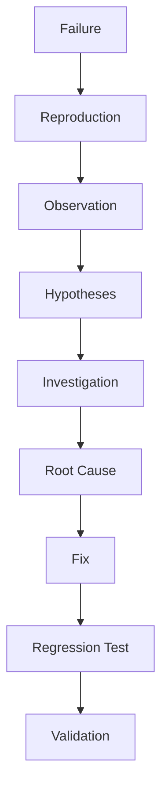

# Agents

[← Índice](../doc.md)

Um **Agent** representa uma responsabilidade de engenharia.

## Agentes planejados (primeira leva)

| Agent       | Foco principal                              |
|------------|----------------------------------------------|
| Architect  | Proposta técnica a partir do problema        |
| Coder      | Implementação                                |
| Reviewer   | Revisão final                                |
| Debugger   | Investigação estruturada de falhas           |
| Tester     | Estratégia e cobertura de testes             |
| Security   | Riscos de segurança                          |
| Challenger | Contestar decisões (evitar overengineering)  |
| Documenter | Documentação de produto e ADRs após workflows   |

## Architect

Responsável por transformar um problema em uma proposta técnica.

**Entrada (exemplo):** `Implement large file upload`

**Saída esperada:**

- requirements
- architecture
- components
- APIs
- data model
- trade-offs
- risks
- testing strategy
- cost considerations

O Architect **não** deve implementar código.

**Artefato exemplo:** `.ai/workspace/architecture.md`

## Challenger

Responsável por contestar uma decisão técnica — o objetivo não é simplesmente concordar com o Architect.

Deve procurar:

- overengineering
- unnecessary complexity
- hidden costs
- security risks
- scalability problems
- unnecessary dependencies
- wrong abstractions

**Exemplo de diálogo:**

| Architect | Challenger |
|-----------|------------|
| "Use SQS to process uploads asynchronously." | "Why is asynchronous processing necessary?" |
| | "Can the initial implementation remain synchronous?" |
| | "What operational complexity does SQS introduce?" |
| | "What is the expected workload?" |

O Challenger existe para evitar que os agentes construam sistemas mais complexos do que o problema exige.

## Coder

Responsável pela implementação.

**Recebe:** requirements, architecture, project context, rules, skills

**Pode:**

- read / modify / create files
- run commands e testes
- inspect git diff

O Coder **não** deve alterar arquitetura silenciosamente. Se encontrar um problema arquitetural:

```text
Coder → Architecture concern → Human / Architect
```

## Tester

Responsável por analisar o comportamento alterado e determinar a estratégia de testes.

Deve responder:

- What changed?
- What can break?
- What tests already exist?
- What tests are missing?
- Which edge cases matter?
- Which tests should be unit vs integration?

Pode posteriormente implementar os testes.

**Artefato:** `.ai/workspace/test-plan.md`

## Security

Responsável por analisar riscos de segurança.

Deve considerar: authentication, authorization, input validation, injection, secrets, permissions, file handling, dependency risks, logging, data exposure, cloud configuration.

Quando a stack for AWS, pode utilizar skills específicas: AWS, S3, Lambda, API Gateway, IAM.

## Reviewer

Responsável pela revisão final.

**Categorias:** Correctness, Security, Performance, Architecture, Maintainability, Testing

**Exemplo de resultado:**

```yaml
status: changes_requested

findings:
  - severity: high
    category: security
    file: src/upload.py
    line: 42
    issue: File type is trusted from client input
    recommendation: Validate file content
```

**Estados possíveis:** `APPROVED` | `CHANGES_REQUESTED` | `BLOCKED`

## Debugger

Processo controlado (não modificar código imediatamente após o erro):



**Artefato:** `.ai/workspace/debug-report.md`

## Documenter

Responsável por sincronizar **documentação do produto** (`docs/`, `README.md`, `doc.md`) com artefatos EAS e mudanças no código, e por registrar **ADRs** em `docs/adr/` quando houver decisões duráveis.

**Entrada:** artefatos em `.ai/workspace/` do workflow (ou escopo livre em invocação isolada), diff git, rules em `.ai/rules/documentation.md`.

**Não deve:** alterar código em `src/`, testes ou pipelines de CI.

**Artefato:** `.ai/workspace/documentation-report.md`

**Workflow:** passo final após Reviewer em feature, bug e review.
