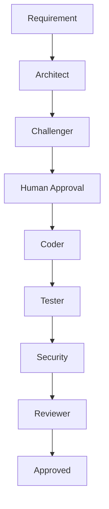

# Workflows

[← Índice](../doc.md)

Workflows coordenam os agentes.

## Feature



## Bug

```text
Bug → Debugger → Root Cause → Coder → Tester → Reviewer
```

## Refactor

```text
Target → Architect → Coder → Tester → Reviewer
```
